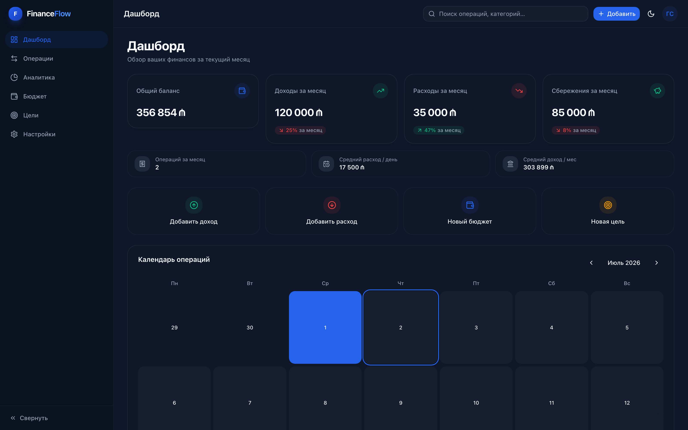
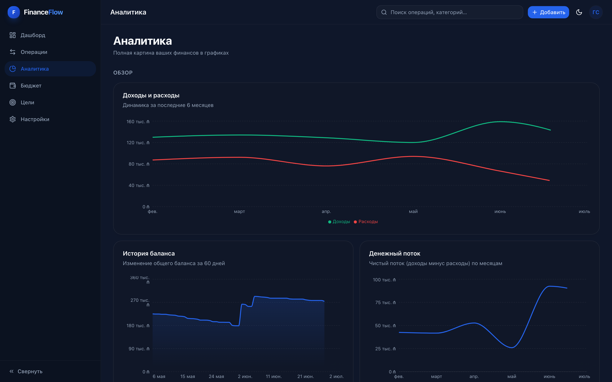
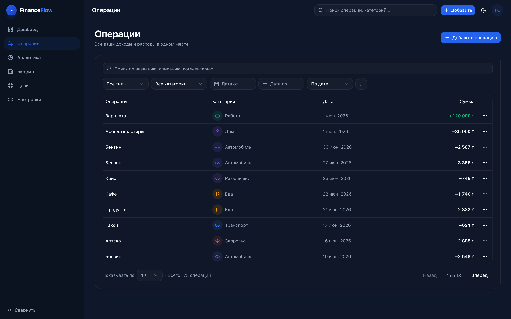

<div align="center">

# FinanceFlow

**Personal Finance Dashboard** — приложение для учёта личных финансов уровня коммерческого SaaS-продукта.


</div>



## Возможности

- **Дашборд** — баланс, доходы/расходы/сбережения с трендами, календарь-heatmap, drag & drop сетка виджетов
- **Операции** — CRUD с поиском, фильтрами по типу/категории/периоду, сортировкой и пагинацией
- **Бюджеты** — лимиты по категориям или на месяц целиком, предупреждения о приближении/превышении
- **Цели** — накопление с прогрессом, сроком и быстрым пополнением
- **Аналитика** — 15 интерактивных графиков (Recharts): динамика доходов/расходов, история баланса, денежный поток, распределение по категориям, сравнение месяцев, хронология операций
- **Авторизация** — email/пароль и Google OAuth через Supabase Auth, восстановление пароля, профиль
- Светлая/тёмная тема, полностью адаптивная вёрстка, анимации на Framer Motion

<table>
<tr>
<td></td>
<td></td>
</tr>
</table>

## Стек

| Слой | Технологии |
|------|------------|
| Frontend | React 19, TypeScript, Vite, Tailwind CSS v4, shadcn/ui (radix-ui) |
| Данные | TanStack Query, React Hook Form, Zod |
| UI и анимации | Framer Motion, Lucide Icons, Recharts, @dnd-kit |
| Роутинг | React Router |
| Backend | Supabase (PostgreSQL, Auth, Row Level Security) |

Архитектура — **Feature-Sliced Design**: `app → pages → widgets → features → entities → shared`. Подробности: [docs/ARCHITECTURE.md](docs/ARCHITECTURE.md).

## Быстрый старт

```bash
npm install
npm run dev
```

Приложение откроется на `http://localhost:5173` и сразу заработает в **демо-режиме**: реалистичные mock-данные хранятся в `localStorage`, регистрация не обязательна.

### Подключение Supabase (опционально)

1. Создайте проект на [supabase.com](https://supabase.com).
2. Выполните [`supabase/schema.sql`](supabase/schema.sql) в SQL Editor — создаст таблицы с Row Level Security.
3. Скопируйте `.env.example` в `.env` и укажите `VITE_SUPABASE_URL` / `VITE_SUPABASE_ANON_KEY` из Settings → API.

```bash
cp .env.example .env
```

Без этих переменных приложение продолжает работать локально — переключение между режимами происходит автоматически.

## Скрипты

| Команда | Назначение |
|---------|------------|
| `npm run dev` | Локальный сервер разработки |
| `npm run build` | Проверка типов + продакшн-сборка |
| `npm run preview` | Просмотр собранного бандла |
| `npm run lint` | ESLint |

## Деплой

Статическая SPA-сборка (`npm run build` → `dist/`), совместима с Vercel, Netlify и любым статическим хостингом. В репозитории уже есть `vercel.json` (rewrites + security-заголовки) и `public/_redirects` (Netlify) для корректной работы клиентского роутинга.

## Структура проекта

```
src/
├── app/          # Инициализация, провайдеры, роутинг, глобальные стили
├── pages/        # Страницы (композиция widgets + features)
├── widgets/      # Крупные самостоятельные блоки UI
├── features/     # Пользовательские сценарии (формы, действия)
├── entities/     # Бизнес-сущности: transaction, category, budget, goal
└── shared/       # UI kit, хуки, утилиты, конфигурация
```

Подробнее об архитектуре и истории разработки по этапам — в [docs/ARCHITECTURE.md](docs/ARCHITECTURE.md) и [docs/DEVELOPMENT.md](docs/DEVELOPMENT.md).
